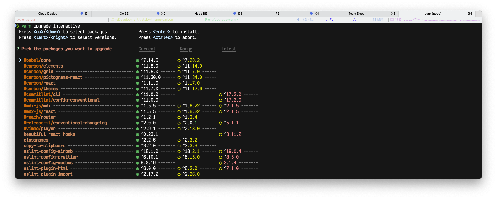

# Website dependency management

We use [`yarn`](https://classic.yarnpkg.com/lang/en/) to manage our dependencies. This means the nexus of our dependency management lies in the `yarn.lock` file. We _*never*_ want to update `yarn.lock` file manually, we can fix everything from the command line using the `yarn` cli.

## TLDR

1. New dependency: `yarn add my-package`
1. New dev dependency: `yarn add -D my-package`
1. Update dependencies: `yarn upgrade-interactive`
1. Update dependencies (include breaking/non-semver): `yarn upgrade-interactive --latest`
1. Remove dependency: `yarn remove my-package`
1. Resolve merge conflict in `yarn.lock`: `yarn`
1. Update package in both `yarn.lock` and `package.json`: `yarn add my-package-i-already-have`

## Adding and removing dependencies

There's two kinds of dependencies: regular dependencies, and dev dependencies. The difference isn't super important for Gatsby sites. However when `NODE_ENV` is `production`, yarn won't install the development dependencies. By installing them in the right category, we can decrease the installation time.

As a rule of thumb, dependencies required to build the site are regular dependencies. Dependencies required to edit the code (linters, formatters, commit checkers, etc.) are dev dependencies.

When a dependency is no longer needed, it should be removed so we can reduce our CI install time.

## Updating dependencies

One major difference between `npm` and `yarn`, is that `yarn` doesn't really care too much about the `package.json` file. The actual versions used to build your project are derived from the `yarn.lock` file at the root of the directory. This makes sense, considering the `package.json` file has semanticly versioned _ranges_ for dependencies.

To update our dependency, we can type `yarn upgrade-interactive`. This let's us chose which packages we want to update individually. If you want to include packages with updates beyond your version range (breaking/non-semver) pass the `latest` flag: `yarn upgrade-interactive --latest`

After selecting the package, and hitting enter, you'll notice nothing changed in the `package.json`. This is because after updating to `@carbon/icons-react@10.14`, our `package.json` is _still correct_ because `10.14.0` satisfies the requirement in our package.json (`^10.13.0`). Simply commit the changes to `yarn.lock` and you're good to go.

If for some reason you really need to update a version in the `package.json` you can re-add the package with: `yarn add @carbon/icons-react` this will update the `package.json` to show the latest version.

## Merge conflicts

If you ever get a merge conflict in your `yarn.lock` file, run the command `yarn`. The file will be updated to resolve the issue. After doing this add and commit the file. Since it's a merge commit, you don't need a commit message: `git add . && git commit`.
