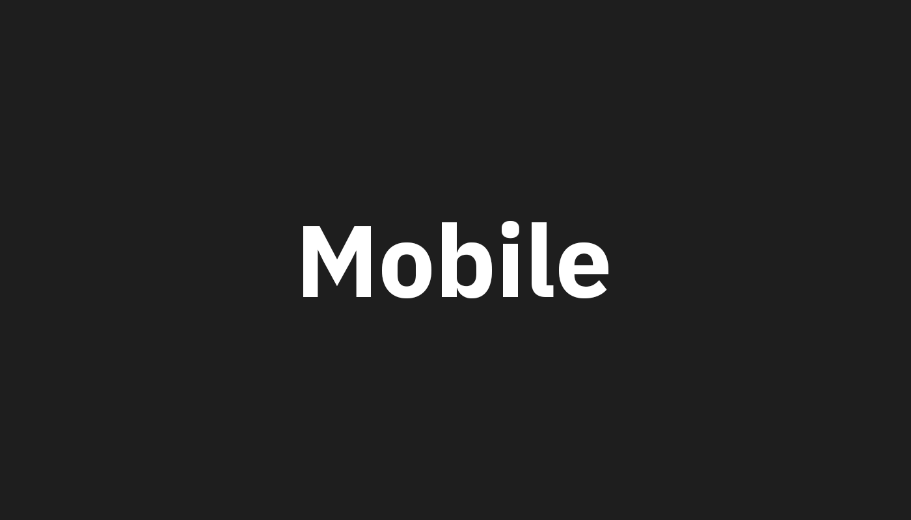

<PageDescription>

On the web, [art direction](https://developer.mozilla.org/en-US/docs/Learn/HTML/Multimedia_and_embedding/Responsive_images#Art_direction) refers to changing the image rendered at different display sizes. The `ArtDirection` component allows you to to provide multiple images achieve this goal.

</PageDescription>

## Example

<ArtDirection>




</ArtDirection>

## Code

You can place up to three images inside of the `ArtDirection` component. The first will be used for mobile, the second for tablet, the third for desktop. The largest available image will be used if one is not provided at a given size.

```markdown path=components/ArtDirection.js src=https://github.com/carbon-design-system/gatsby-theme-carbon/tree/master/packages/gatsby-theme-carbon/src/components/ArtDirection
<ArtDirection>


</ArtDirection>
```
