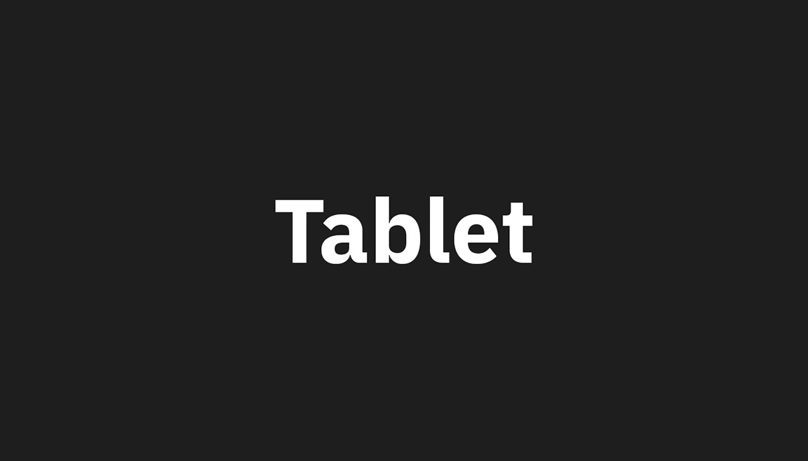

<PageDescription>

On the web,
[art direction](https://developer.mozilla.org/en-US/docs/Learn/HTML/Multimedia_and_embedding/Responsive_images#Art_direction)
refers to changing the image rendered at different display sizes. The
`ArtDirection` component allows you to provide multiple images achieve this
goal.

</PageDescription>

## Example

<ArtDirection>





</ArtDirection>

## Code

You can place up to three images inside of the ArtDirection component. The first
will be used for mobile, the second for tablet, and the third for desktop. If
only two images are provided, the second image will be used for both tablet and
desktop.

```mdx path=components/ArtDirection.js src=https://github.com/carbon-design-system/gatsby-theme-carbon/tree/main/packages/gatsby-theme-carbon/src/components/ArtDirection
<ArtDirection>


</ArtDirection>
```
