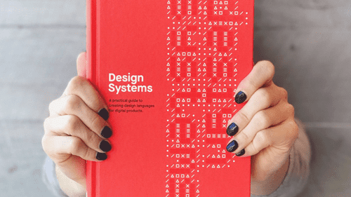

<PageDescription>

The `<Aside>` component is a wrapper component that adds styling to make the text display smaller than the default body text; using `body-long-01` and adds the correct top border styles. It should be used within a smaller `<Column>` width.

</PageDescription>

## Example

<Row>
<Column colMd={5} colLg={7} className="bx--type-expressive-heading-03">



</Column>
<Column colSm={0} colMd={2} colLg={3} offsetMd={1} noGutterSm>
<Aside>

**Good design is always good design.**

What we borrow from our own design history is not a mid-century aesthetic in stylistic terms, but the modernist attitudes and approach used at the time.

</Aside>

</Column>
</Row>

## Code

```
<Column colSm={0} colMd={2} colLg={3} offsetMd={1} noGutterSm>
<Aside>

**Good design is always good design.**

What we borrow from our own design history is not a mid-century aesthetic in stylistic terms, but the modernist attitudes and approach used at the time.

</Aside>

</Column>
```

### Props

| property  | propType | required | default | description           |
| --------- | -------- | -------- | ------- | --------------------- |
| children  | node     |          |         |                       |
| className | string   |          |         | Add custom class name |
