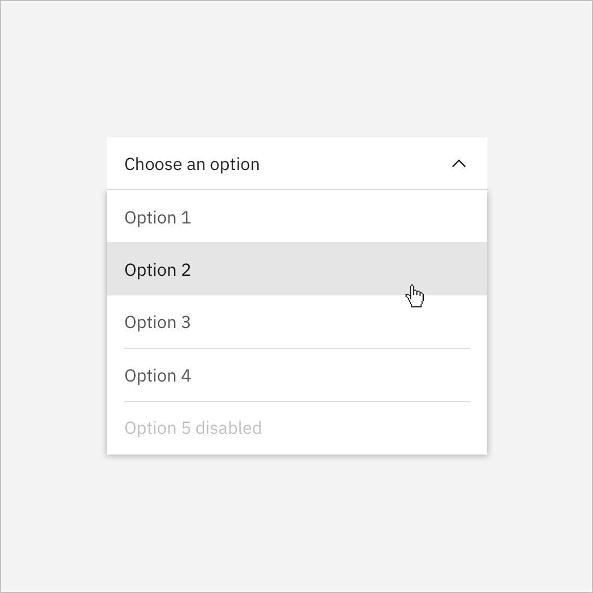

<PageDescription>

The `<DoDontExample>` component will generally need to be placed inside `<Row>` and `<Column>` components to align them to the grid at the correct size.

</PageDescription>

## Example

<Row>
<Column colMd={4} colLg={4}>

#### Image

<DoDontExample type="do" captionTitle="Caption title" caption="Caption">



</DoDontExample>
</Column>
<Column colMd={4} colLg={4}>

#### Text

<DoDontExample type="dont" aspectRatio="1:1"  color="dark" captionTitle="Caption title" caption="Caption" text="This is some text" />
</Column>
</Row>
<Row>
<Column colLg={8}>

#### Video

<DoDontExample type="do" caption="Caption" captionTitle="Caption title">

<Video title="Video example" vimeoId="310583077" />

</DoDontExample>
</Column>
</Row>

## Code

#### Image

```jsx path=components/DoDontExample/DoDontExample.js src=https://github.com/carbon-design-system/gatsby-theme-carbon/tree/master/packages/gatsby-theme-carbon/src/components/DoDontExample
<DoDontExample type="do" captionTitle="Caption title" caption="Caption">
  
</DoDontExample>
```

#### Text

```jsx path=components/DoDontExample/DoDontExample.js src=https://github.com/carbon-design-system/gatsby-theme-carbon/tree/master/packages/gatsby-theme-carbon/src/components/DoDontExample
<DoDontExample
  type="dont"
  aspectRatio="1:1"
  color="dark"
  captionTitle="Caption title"
  caption="Caption"
  text="This is some text"
/>
```

#### Video

```jsx path=components/DoDontExample/DoDontExample.js src=https://github.com/carbon-design-system/gatsby-theme-carbon/tree/master/packages/gatsby-theme-carbon/src/components/DoDontExample
<DoDontExample type="do" caption="Caption" captionTitle="Caption title">
  <Video vimeoId="310583077" />
</DoDontExample>
```

## Props

| property     | propType | required | default | description                                                                                                                                                                                                                                        |
| ------------ | -------- | -------- | ------- | -------------------------------------------------------------------------------------------------------------------------------------------------------------------------------------------------------------------------------------------------- |
| children     | node     |          |         | child node, expects a markdown image or `<Video>` component                                                                                                                                                                                        |
| text         | string   |          |         | text to display inside the component instead of an image or video                                                                                                                                                                                  |
| caption      | string   |          |         | caption                                                                                                                                                                                                                                            |
| captionTitle | string   |          |         | caption title                                                                                                                                                                                                                                      |
| type         | string   |          | dont    | set to `do` to show green check, otherwise shows pink X                                                                                                                                                                                            |
| color        | string   |          | light   | set to `dark` for dark background card                                                                                                                                                                                                             |
| aspectRatio  | string   |          |         | set to `1:1` to force square example <br/>_(We welcome [contributions](https://github.com/carbon-design-system/gatsby-theme-carbon/tree/master/packages/gatsby-theme-carbon/src/components/DoDontExample) to add additional aspect ratio options)_ |
