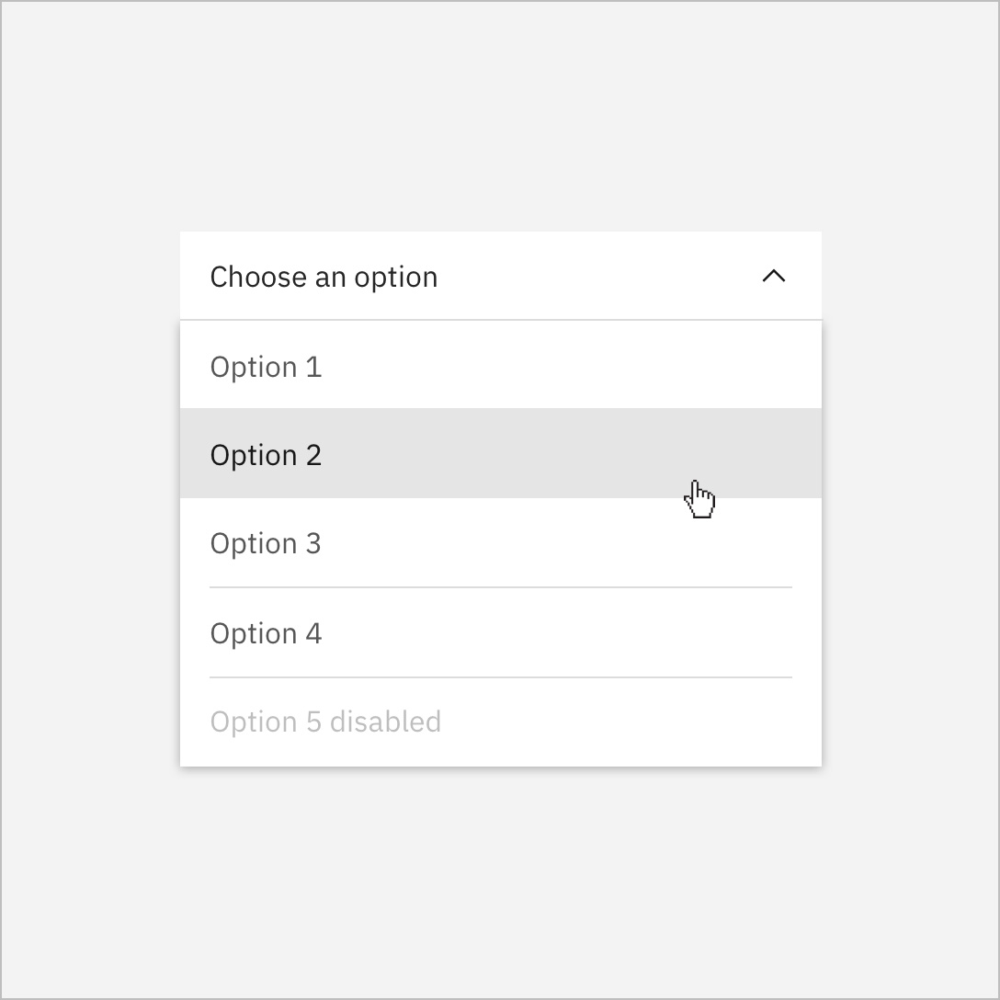

<PageDescription>

The `<DoDontRow>` component is a custom row used alongside the `<DoDont>`
component, which now includes built in columns.

</PageDescription>

## Example

<DoDontRow>

<DoDont aspectRatio="1:1">



</DoDont>

<DoDont aspectRatio="1:1" type="dont">


</DoDont>

</DoDontRow>

<DoDontRow>

<DoDont aspectRatio="1:1" text="This is some text" />

<DoDont type="dont" aspectRatio="1:1" text="This is some text" color="dark" />

</DoDontRow>

<DoDontRow>

<DoDont
  text="This is some text"
  color="dark"
  captionTitle="Caption title"
  caption="Caption"
  colLg="8"
/>

</DoDontRow>

<DoDontRow>

<DoDont colLg='8' captionTitle="Caption title" caption="Caption">

<Video title="Video example" vimeoId="310583077" />

</DoDont>

</DoDontRow>

## Code

### Image

```mdx path=components/DoDontRow/DoDontRow.js src=https://github.com/carbon-design-system/gatsby-theme-carbon/tree/main/packages/gatsby-theme-carbon/src/components/DoDontRow
<DoDontRow>
  <DoDont aspectRatio="1:1"></DoDont>
  <DoDont type="dont" aspectRatio="1:1">
    
  </DoDont>
</DoDontRow>
```

### Text

```mdx path=components/DoDontRow/DoDontRow.js src=https://github.com/carbon-design-system/gatsby-theme-carbon/tree/main/packages/gatsby-theme-carbon/src/components/DoDontRow
<DoDontRow>
  <DoDont text="This is some text" aspectRatio="1:1" />
  <DoDont type="dont" text="This is some text" color="dark" aspectRatio="1:1" />
</DoDontRow>
<DoDontRow>
  <DoDont
    text="This is some text"
    captionTitle="Caption title"
    caption="Caption"
    aspectRatio="1:1"
    colLg="8"
  />
</DoDontRow>
```

### Video

```mdx path=components/DoDontRow/DoDontRow.js src=https://github.com/carbon-design-system/gatsby-theme-carbon/tree/main/packages/gatsby-theme-carbon/src/components/DoDontRow
<DoDontRow>
  <DoDont captionTitle="Caption title" caption="Caption" colLg="8">
    <Video title="Video example" vimeoId="310583077" />
  </DoDont>
</DoDontRow>
```

## Props

### DoDontRow

| property | propType | required | default | description                              |
| -------- | -------- | -------- | ------- | ---------------------------------------- |
| children | node     | yes      |         | child node, expects a `DoDont` component |

### Do & Dont

| property       | propType | required | default            | description                                                                                                                                                                                                                                      |
| -------------- | -------- | -------- | ------------------ | ------------------------------------------------------------------------------------------------------------------------------------------------------------------------------------------------------------------------------------------------ |
| children       | node     |          |                    | child node, expects a markdown image or `<Video>` component                                                                                                                                                                                      |
| text           | string   |          |                    | text to display inside the component instead of an image or video                                                                                                                                                                                |
| caption        | string   |          |                    | caption                                                                                                                                                                                                                                          |
| captionTitle   | string   |          |                    | caption title                                                                                                                                                                                                                                    |
| color          | string   |          | light              | set to `dark` for dark background card                                                                                                                                                                                                           |
| aspectRatio    | string   |          |                    | set to `1:1` to force square example <br/>_(We welcome [contributions](https://github.com/carbon-design-system/gatsby-theme-carbon/tree/main/packages/gatsby-theme-carbon/src/components/DoDontExample) to add additional aspect ratio options)_ |
| type           | string   |          | `do`               | specify the type of example with `do` or `dont`                                                                                                                                                                                                  |
| ...columnProps | number   |          | `colMd=4, colLg=4` | specify any `<Column>` props to pass down                                                                                                                                                                                                        |
