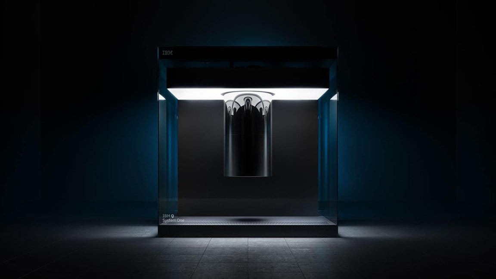

<PageDescription>

These are the built in components that you’ll have access to simply by using
markdown. The whitespace around these components **is significant**. If you
encounter any errors, make sure you format the markdown and surounding space
properly.

For most pages, we recommend starting with a `PageDescription` followed by
`AnchorLinks` if the content is long enough.

</PageDescription>

<AnchorLinks>
  <AnchorLink>Text decoration</AnchorLink>
  <AnchorLink>Headers</AnchorLink>
  <AnchorLink>Lists</AnchorLink>
  <AnchorLink>Links</AnchorLink>
  <AnchorLink>Images</AnchorLink>
  <AnchorLink>Code blocks</AnchorLink>
  <AnchorLink>Tables</AnchorLink>
  <AnchorLink>Blockquotes and citations</AnchorLink>
  <AnchorLink>Comments</AnchorLink>
</AnchorLinks>

## Text decoration

Emphasis, aka italics, with _asterisks_ or _underscores_. Strong emphasis, aka
bold, with **asterisks** or **underscores**. Combined emphasis with **asterisks
and _underscores_**. Strikethrough uses two tildes. ~~Scratch this.~~

### Code

```markdown https://github.com/carbon-design-system/gatsby-theme-carbon/tree/main/packages/gatsby-theme-carbon/src/components/markdown
Emphasis, aka italics, with _asterisks_ or _underscores_. Strong emphasis, aka
bold, with **asterisks** or **underscores**. Combined emphasis with **asterisks
and _underscores_**. Strikethrough uses two tildes. ~~Scratch this.~~
```

## Headers

**Note:** It’s generally considered
[best practice](https://webaim.org/techniques/semanticstructure/#contentstructure)
to include just one `h1` heading per page. This heading signals the title or
primary subject matter of the content to your audience. Because the title
component generated at the top of each page already uses an `h1` heading, we
recommend using `h2` tags for section headings within your content.

## H2

### H3

#### H4

##### H5

### Code

```markdown src=https://github.com/carbon-design-system/gatsby-theme-carbon/tree/main/packages/gatsby-theme-carbon/src/components/markdown
## H2

### H3

#### H4

##### H5
```

## Lists

**Unordered lists**

- Unordered list can use asterisks
- Or hyphens to create list items
- Lorem ipsum dolor sit amet, consectetur adipiscing elit, sed do eiusmod tempor
  incididunt ut labore et
- dolore magna aliqua. Pharetra massa massa ultricies mi quis. Adipiscing enim
  eu turpis egestas pretium aenean.
- Massa eget egestas purus viverra accumsan in nisl nisi.
- Dolor sit amet consectetur adipiscing elit pellentesque habitant morbi
  tristique.

**Ordered lists**

1. First ordered list item
2. Item with a nested item
   1. Nested list item
3. In markdown, the actual numbers don’t matter, just that it’s a number
4. In markdown, the actual numbers don’t matter, just that it’s a number
5. In markdown, the actual numbers don’t matter, just that it’s a number
6. In markdown, the actual numbers don’t matter, just that it’s a number
7. In markdown, the actual numbers don’t matter, just that it’s a number
8. In markdown, the actual numbers don’t matter, just that it’s a number
9. In markdown, the actual numbers don’t matter, just that it’s a number
10. In markdown, the actual numbers don’t matter, just that it’s a number
11. In markdown, the actual numbers don’t matter, just that it’s a number

**Nested lists**

- Unordered list can use asterisks
  - Nested list item
- Or hyphens to create list items

### Code

```markdown src=https://github.com/carbon-design-system/gatsby-theme-carbon/tree/main/packages/gatsby-theme-carbon/src/components/markdown
- Unordered list can use asterisks

* Or hyphens to create list items

- Lorem ipsum dolor sit amet, consectetur adipiscing elit, sed do eiusmod tempor
  incididunt ut labore et
- dolore magna aliqua. Pharetra massa massa ultricies mi quis. Adipiscing enim
  eu turpis egestas pretium aenean.
- Massa eget egestas purus viverra accumsan in nisl nisi.
- Dolor sit amet consectetur adipiscing elit pellentesque habitant morbi
  tristique.
```

```markdown src=https://github.com/carbon-design-system/gatsby-theme-carbon/tree/main/packages/gatsby-theme-carbon/src/components/markdown
1. First ordered list item
2. Item with a nested item
   1. Nested list item
3. In markdown, the actual numbers don’t matter, just that it’s a number
4. In markdown, the actual numbers don’t matter, just that it’s a number
```

```markdown src=https://github.com/carbon-design-system/gatsby-theme-carbon/tree/main/packages/gatsby-theme-carbon/src/components/markdown
1. First ordered list item
1. Item with a nested item
   1. Nested list item
1. In markdown, the actual numbers don’t matter, just that it’s a number
```

## Links

[I’m a local link](/components/demo)

[I’m a markdown link](https://www.carbondesignsystem.com)

[I’m a markdown link with title](https://www.carbondesignsystem.com 'Carbon’s Homepage')

URLs and URLs in angle brackets will automatically get turned into links.
http://www.example.com or <http://www.example.com> and sometimes example.com
(but not on Github, for example).

### Code

```markdown src=https://github.com/carbon-design-system/gatsby-theme-carbon/tree/main/packages/gatsby-theme-carbon/src/components/markdown
[I’m a markdown link](https://www.carbondesignsystem.com)

[I’m a markdown link with title](https://www.carbondesignsystem.com 'Google’s Homepage')

[I’m a local link](/components/demo)

URLs and URLs in angle brackets will automatically get turned into links.
http://www.example.com or <http://www.example.com> and sometimes example.com
(but not on Github, for example).

Some text to show that the reference links can follow later.
```

## Images



### Code

```markdown src=https://github.com/carbon-design-system/gatsby-theme-carbon/tree/main/packages/gatsby-theme-carbon/src/components/markdown

```

## Code blocks

You can read in depth about syntax highlighting and advanced code snippet
features on the [Code blocks](/components/code-blocks) page.

Inline `code` has `back-ticks around` it.

```markdown Title
Blocks of code have three back-ticks above and below.

You can specify a language by placing it after the backticks.

You can also supply a source code URL or title to go at the top of the code
block
```

### Code

````markdown src=https://github.com/carbon-design-system/gatsby-theme-carbon/tree/main/packages/gatsby-theme-carbon/src/components/markdown
Inline `code` has `back-ticks around` it.

```markdown Title
Blocks have three back-ticks above and below. Pretend the backslashes aren’t
there.
```
````

You can view a list of included languages at the
[react-prism-renderer repo](https://github.com/FormidableLabs/prism-react-renderer/blob/master/src/vendor/prism/includeLangs.js).

## Tables

Colons can be used to align columns.

| Tables   |      Are      | Cool |
| -------- | :-----------: | ---: |
| col 3 is | right-aligned |    1 |
| col 2 is |   centered    |    2 |

There must be at least 3 dashes separating each header cell. The outer pipes (|)
are optional, and you don’t need to make the raw Markdown line up prettily. You
can also use inline Markdown.

| Markdown | Less      | Pretty     |
| -------- | --------- | ---------- |
| _Still_  | `renders` | **nicely** |
| 1        | 2         | 3          |

### Code

```markdown src=https://github.com/carbon-design-system/gatsby-theme-carbon/tree/main/packages/gatsby-theme-carbon/src/components/markdown
Colons can be used to align columns.

| Tables        |      Are      |   Cool |
| ------------- | :-----------: | -----: |
| col 3 is      | right-aligned | \$1600 |
| col 2 is      |   centered    |   \$12 |
| zebra stripes |   are neat    |    \$1 |

There must be at least 3 dashes separating each header cell. The outer pipes (|)
are optional, and you don’t need to make the raw Markdown line up prettily. You
can also use inline Markdown.

| Markdown | Less      | Pretty     |
| -------- | --------- | ---------- |
| _Still_  | `renders` | **nicely** |
| 1        | 2         | 3          |
```

## Blockquotes and citations

> Without aesthetic, design is either the humdrum repetition of familiar clichés
> or a wild scramble for novelty. Without aesthetic, the computer is but a
> mindless speed machine, producing effects without substance, form without
> relevant content, or content without meaningful form.
>
> <cite>– Paul Rand</cite>

### Code

```markdown path=components/markdown src=https://github.com/carbon-design-system/gatsby-theme-carbon/tree/main/packages/gatsby-theme-carbon/src/components/markdown
> Without aesthetic, design is either the humdrum repetition of familiar clichés
> or a wild scramble for novelty. Without aesthetic, the computer is but a
> mindless speed machine, producing effects without substance, form without
> relevant content, or content without meaningful form.
>
> <cite>– Paul Rand</cite>
```

## Comments

Comments can be added that will not display on the page, but will be visible in
the markdown source.

<!-- Comments like this are visible in code, but are not visible on the page -->

### Code

```markdown src=https://github.com/carbon-design-system/gatsby-theme-carbon/tree/main/packages/gatsby-theme-carbon/src/components/markdown
Comments can be added that will not display on the page, but will be visible in
the markdown source.

<!-- Comments like this are visible in code, but are not visible on the page -->
```
