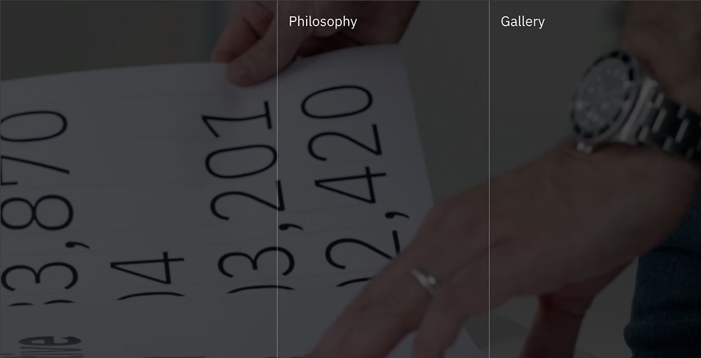
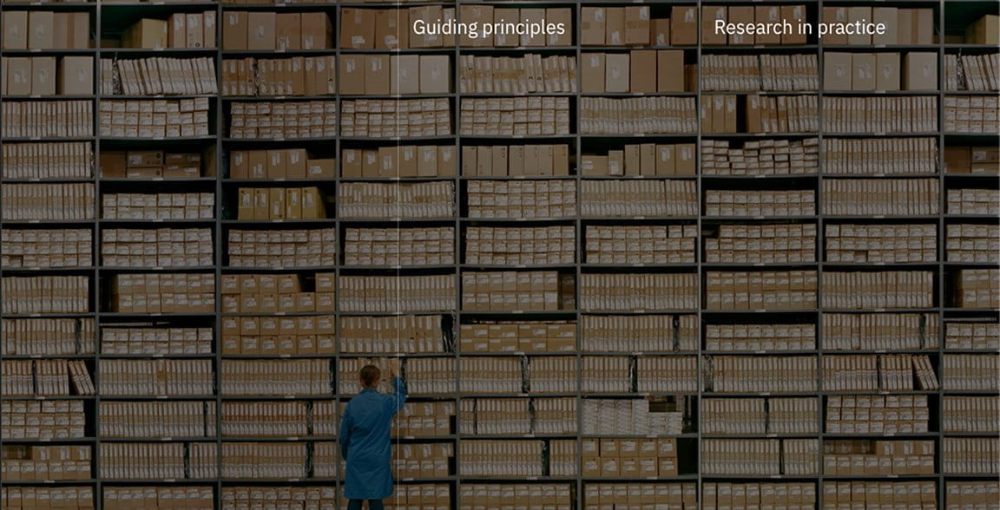

<PageDescription>

We have a multitude of sites using the gatsby theme for both public and internal
sites. Using this theme we’ve been able to propogate features and fixes
throughout the ecosystem quickly and easily.

</PageDescription>

## IBM Design for AI

<FeatureCard
  title="IBM Design for AI"
  actionIcon="arrowRight"
  href="https://ibm.com/design/ai/"
  color="dark"
  >

</FeatureCard>

## IBM Design Language

<FeatureCard
  title="IBM Design Language"
  actionIcon="arrowRight"
  href="https://www.ibm.com/design/language/"
  color="dark"
  >

</FeatureCard>

## Carbon Design System

<FeatureCard
  title="Carbon Design System"
  actionIcon="arrowRight"
  href="http://carbondesignsystem.com/"
  color="dark"
  >

</FeatureCard>

## IBM Design Research

<FeatureCard
  title="IBM Design Research"
  actionIcon="arrowRight"
  href="https://ibm.com/design/research/"
  color="dark"
  >

</FeatureCard>

## IBM Design Event

<FeatureCard
  title="IBM Design Event"
  actionIcon="arrowRight"
  href="https://ibm.com/design/event/"
  color="dark"
  >

</FeatureCard>
