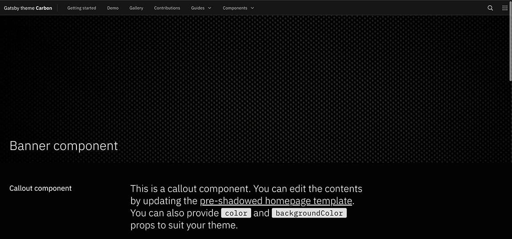

<PageDescription>

Gatsby themes allow you to override configuration from the theme by defining the
same property in your `gatsby-config.js` at the root of your project. You can
see the default configuration provided by the theme’s
[`gatsby-config.js`](https://github.com/carbon-design-system/gatsby-theme-carbon/blob/main/packages/gatsby-theme-carbon/gatsby-config.js)
file.

</PageDescription>

<AnchorLinks>
  <AnchorLink>Site metadata</AnchorLink>
  <AnchorLink>Manifest</AnchorLink>
  <AnchorLink>Theming</AnchorLink>
  <AnchorLink>Favicon</AnchorLink>
  <AnchorLink>Image compression</AnchorLink>
  <AnchorLink>Global search</AnchorLink>
  <AnchorLink>Navigation style</AnchorLink>
  <AnchorLink>Edit on Github link</AnchorLink>
  <AnchorLink>Medium</AnchorLink>
  <AnchorLink>Other options</AnchorLink>
</AnchorLinks>

## Site metadata

To add a title and description to each page, simply provide them to siteMetadata
in your `gatsby-config.js` file.

The language attribute applied to the `<html>` tag on every page is English
(`en`) by default, but you can choose to override this. For more information on
declaring the language of a page in HTML, please review
[W3 Criterion 3.1.1 Language of a Page](https://www.w3.org/WAI/WCAG21/Understanding/language-of-page).

```js
module.exports = {
  siteMetadata: {
    title: 'Gatsby Theme Carbon',
    description: 'A Gatsby theme for the carbon design system',
    keywords: 'gatsby,theme,carbon',
    lang: 'en',
  },
  plugins: ['gatsby-theme-carbon'],
};
```

## Manifest

One of the first configurations should be to override the default manifest
options, you can do this in `gatsby-config.js`. Any options you don’t set, will
be provided by the theme. See the example project.

```js
siteMetadata: {
    title: 'Gatsby Theme Carbon',
  },
  plugins: [
    'gatsby-theme-carbon',
    {
      resolve: 'gatsby-plugin-manifest',
      options: {
        name: 'Carbon Design Gatsby Theme',
        short_name: 'Gatsby Theme Carbon',
        start_url: '/',
        background_color: '#ffffff',
        theme_color: '#0062ff',
        display: 'browser',
      },
    },
  ],
```

## Theming

With theming, you can control the colors being used on the homepage as well as
the interior pages. Your choices include `white`, `dark`, and `g10`. The default
for the homepage and the interior theme are dark and g10, respectively.

```js
  plugins: [
    {
      resolve: 'gatsby-theme-carbon',
      options: {
        theme: {
          homepage: 'dark',
          interior: 'g10',
        },
      },
    },
  ],
```

## Favicon

If you need to override the default favicon, you can do so by passing a relative
path to the icon. It’s recommended to provide a 512 x 512 version.

**IMPORTANT:** For best results, if you’re providing an icon for generation it
should be…

- at least as big as the largest icon being generated (512x512 by default).
- square (if it’s not, transparent bars will add to make it square).
- of one of the follow formats: JPEG, PNG, WebP, TIFF, GIF or SVG.

```js
plugins: [
    {
      resolve: 'gatsby-theme-carbon',
      options: {
        iconPath: './src/images/custom-icon-512.jpg'
      },
    },
  ],
```

## Image compression

You can enable WebP by passing `withWebp: true` or providing your own
optimization level. See the gatsby-remark-images
[plugin options](https://www.gatsbyjs.org/packages/gatsby-remark-images/#options).
You can also tweak the image quality based on design tolerance and performance
thresholds.

```js
module.exports = {
  plugins: [
    {
      resolve: 'gatsby-theme-carbon',
      options: {
        withWebp: true, // true, false (default false)
        imageQuality: 50, // 0-100 (default 75)
      },
    },
  ],
};
```

## Global search

Site-wide search is provided by the theme. The only requirement for a page to
show up in the results is for it to have `title` set in the
[frontmatter](/components/MDX#frontmatter). To render more helpful search
results (and improve SEO), you’ll want to make sure your pages have
`description` set in the frontmatter as well.

Global search is enabled by default. To disable it, set the `isSearchEnabled`
option to false.

```js
  plugins: [
    {
      resolve: 'gatsby-theme-carbon',
      options: {
        isSearchEnabled: false
      },
    },
  ],
```

Under the hood, we use [Lunr](https://lunrjs.com/) to create our search index.
If necessary, you tweak the search scoring algorithm and source nodes. To do so,
provide your own
[resolvers object](https://www.gatsbyjs.org/packages/gatsby-plugin-lunr/#getting-started)
to the `lunrOptions` theme option.

## Navigation style

By default, the navigation style used by the theme is a sidebar that sits on the
left-hand side of the screen. You can see it right now as you read this
documentation. This style works great for websites with a lot of content, like
documentation sites.

However, if your site is more editorial in nature, and has less pages of
content, you may want to use the `header` navigation. This will remove the
sidebar on the left-hand side of the page and replace it with a navigation menu
that sits in the header. If in the future, the content on your site evolves and
you feel the left nav is better suited, you can always change it back.

To enable the header nav, provide `header` as a string to the `navigationStyle`
option. To switch back to the default left nav provide an empty string `''` to
the `navigationStyle` option. Note: By using the `header` navigation style, you
will lose the ResourceLinks that sit directly below the left nav.

```js
  plugins: [
    {
      resolve: 'gatsby-theme-carbon',
      options: {
        navigationStyle: 'header',
      },
    },
  ],
```

When enabled, your header navigation will look like the image below:

<Row>
<Column colMd={8} colLg={8}>



</Column>
</Row>

With the header navigation style enabled, the content on your page will be
further left-aligned to allow for more content space.

**Just a note:** In mobile-view, when the header navigation is enabled, the
sidebar will persist.

## Edit on GitHub link

To add a link to the bottom of each page that points to the current page source
in GitHub, provide a `repository` object to `siteMetadata` in your
`gatsby-config.js` file. You can provide a `baseUrl`, and if needed, the
`subDirectory` and `branch` where your site source lives.

To disable the `Edit in Github` link, remove the `repository` option. If the
options object is now empty, delete it all together.

```js
  plugins: [
    {
      resolve: 'gatsby-theme-carbon',
      options: {
        repository: {
          baseUrl: 'https://github.com/carbon-design-system/gatsby-theme-carbon',
          subDirectory: '/packages/example',
          branch: 'main',
        },
      },
    },
  ],
```

## Medium

In order to change the source account for the
[`MediumPosts`](/components/MediumPosts) component, provide an account with the
`mediumAccount` option.

```js
plugins: [
  {
    resolve: 'gatsby-theme-carbon',
    options: {
      mediumAccount: 'carbondesign',
    },
  },
];
```

## Other options

- `mdxExtensions` – change the file extensions processed by `gatsby-mdx`
  (default ['.mdx', '.md']).
- `isSwitcherEnabled` - pass `false` to remove the Site switcher from the header
  navigation.
- `titleType` – pick between four formats for the `<title>` element for your
  site. Here are the four options using this page as an example:

  - `page`: "Configuration" (default)
  - `site`: "Gatsby Theme Carbon"
  - `append`: "Gatsby Theme Carbon – Configuration"
  - `prepend`: "Configuration - Gatsby Theme Carbon"

```js
plugins: [
    {
      resolve: 'gatsby-theme-carbon',
      options: {
        mdxExtensions: ['.mdx'],
        titleType: 'append'
      },
    },
  ],
```

## Additional remark plugins and override existing remark plugin configuration

- `gatsbyRemarkPlugins` - An array containing gatsby remark plugin
  configurations to be added/overridden.
- `remarkPlugins` - An array containing
  [remark plugin configurations](https://www.gatsbyjs.org/packages/gatsby-plugin-mdx/#remark-plugins)
  to be added.

The `gatsbyRemarkPlugins` option is compatible with all gatsby-remark-\*
plugins, for example `gatsby-remark-mermaid`. If a gatsby remark plugin does not
work, you can try calling the (underlying) remark plugin directly using the
`remarkPlugins` option.

### Example [Gatsby Remark Mermaid plugin](https://www.gatsbyjs.org/packages/gatsby-remark-mermaid/)

For the below markdown snippet:

````

````

to turn into an image one should add the following configuration to her/his own
project:

```js
 plugins: [
    {
      resolve: 'gatsby-theme-carbon',
      options: {
        repository: {
          baseUrl: 'https://github.com/carbon-design-system/gatsby-theme-carbon',
          subDirectory: '/packages/example',
          branch: 'main',
        },
        gatsbyRemarkPlugins: [
          {
            resolve: 'gatsby-remark-mermaid',
            options: {
              language: 'mermaid',
              theme: 'dark',
              viewport: {
                width: 200,
                height: 200,
              },
              mermaidOptions: {
                themeCSS: '.node rect { fill: cornflowerblue; }',
              },
            },
          },
        ],
      },
    },
  ],

```

### Example [Remark Grid Tables](https://github.com/zestedesavoir/zmarkdown/tree/master/packages/remark-grid-tables)

For the below markdown snippet:

```
+-------+----------+------+
| Table Headings   | Here |
+-------+----------+------+
| Sub   | Headings | Too  |
+=======+==========+======+
| cell  | column spanning |
+ spans +----------+------+
| rows  | normal   | cell |
+-------+----------+------+
| multi | cells can be    |
| line  | *formatted*     |
|       | **paragraphs**  |
| cells |                 |
| too   |                 |
+-------+-----------------+
```

After installing the `remark-grid-tables` plugin, add it to the `remarkPlugins`
array in the theme options.

```js
 plugins: [
    {
      resolve: 'gatsby-theme-carbon',
      options: {
        remarkPlugins: [require("remark-grid-tables")],
      },
    },
  ],
```
