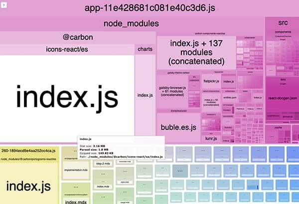

<PageDescription>

Site's built with the Carbon Gatsby theme starter come ready to go with some helpful npm scripts. You can run these commands by typing `yarn [command]` or `npm run [command]`

</PageDescription>

## Clean
- **clean** - this is used to clean gatsby's cache and public directory. It should be used sparingly, only when you're experiencing weird errors or caching issues.

## Develop
- **develop** - this is your primary for starting up your gatsby site for development
- **develop:clean** - this is provided as a convenience; it first runs `clean` then `develop`

## Build
- **build** - this is what you'll use to bundle your site. Gatsby will minimize your images and create a static, blazing fast site in your `public` directory
- **serve** - this can be run to serve the bundle locally after running `build`. It can be used to debug locally if any issues are encountered durring build.
- **build:clean** - this is a provided as a convenience, it first runs `clean` then `build`
- **build:prefix** - this will append all of your links with a [`pathPrefix`](https://www.gatsbyjs.org/docs/path-prefix/) specified in your `gatsby-config.js`
- **serve:prefix** - this will allow you to serve the file locally using a prefixed site built with `build:prefix`
- **test:prefix** - this is provided as a convenience; it first runs `build:prefix` then `test:prefix`
- **build:analyze** - this will run build while also running [webpack-bundle-analyzer](https://github.com/webpack-contrib/webpack-bundle-analyzer) to help debug bundle size issues
    