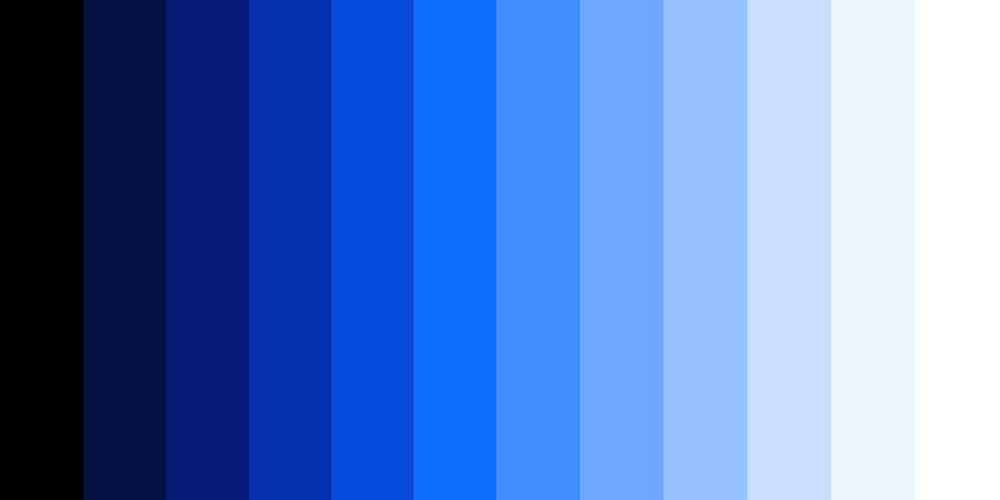
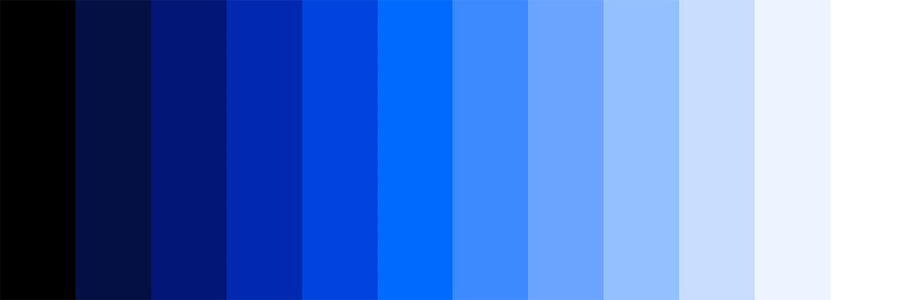

import HomepageTemplate from '../components/Homepage.js';
export default HomepageTemplate;

## MDX content starts here

<PageDescription>

The homepage content here lives in the `src/pages/index.mdx` directory at the
root of your project. Just like the other mdx pages, you can use all of our
theme components here without importing them. Review the
[MDX example source](https://github.com/carbon-design-system/gatsby-theme-carbon/blob/main/packages/example/src/pages/index.mdx).

</PageDescription>

<FeatureCard
    color="dark"
    href="/getting-started"
    title="Getting started"
    actionIcon="arrowRight"
    className="homepage-feature"
    >

<ArtDirection>

</ArtDirection>

</FeatureCard>

## Tools and resources

<Row className="resource-card-group">
  <Column colMd={4} colLg={4} noGutterSm>
    <ResourceCard
      href="/guides/v4-migration"
      title="V4.0 Migration"
      actionIcon="arrowRight"
      aspectRatio="2:1"
      color="dark"
    />
  </Column>
  <Column colMd={4} colLg={4} noGutterSm>
    <ResourceCard
      href="/guides/configuration"
      title="Configuration guide"
      actionIcon="arrowRight"
      aspectRatio="2:1"
      color="dark"
    />
  </Column>
  <Column colMd={4} colLg={4} noGutterSm>
    <ResourceCard
      href="/contributions"
      title="Contributions"
      actionIcon="arrowRight"
      aspectRatio="2:1"
      color="dark"
    />
  </Column>
  <Column colMd={4} colLg={4} noGutterSm>
    <ResourceCard
      href="/demo"
      title="Demo"
      actionIcon="arrowRight"
      aspectRatio="2:1"
      color="dark"
    />
  </Column>
  <Column colMd={4} colLg={4} noGutterSm>
    <ResourceCard
      href="https://github.com/carbon-design-system/gatsby-theme-carbon"
      title="Github"
      actionIcon="arrowRight"
      aspectRatio="2:1"
      color="dark"
    />
  </Column>
  <Column colMd={4} colLg={4} noGutterSm>
    <ResourceCard
      href="/gallery"
      title="Gallery"
      actionIcon="arrowRight"
      aspectRatio="2:1"
      color="dark"
    />
  </Column>
</Row>
