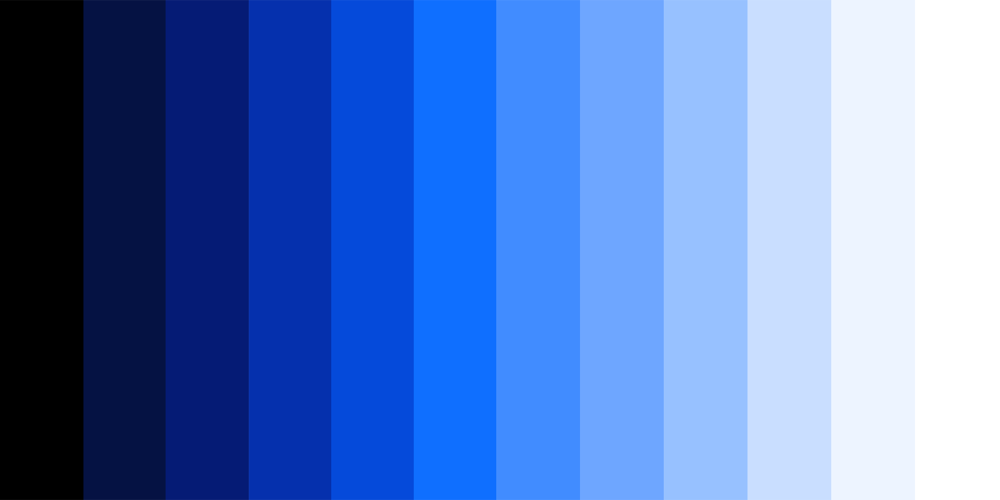
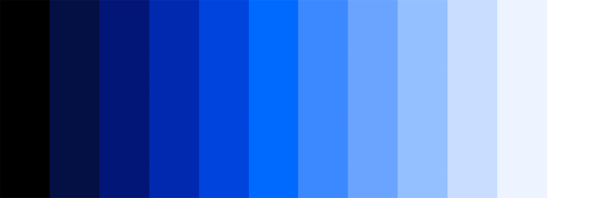

import HomepageTemplate from 'gatsby-theme-carbon/src/templates/Homepage';
export default HomepageTemplate;

## MDX content starts here

<PageDescription>

The homepage content here lives in the `src/pages/index.mdx` directory at the root of your project. Just like the other mdx pages, you can use all of our theme components here without importing them. Review the [MDX example source](https://github.com/carbon-design-system/gatsby-theme-carbon/blob/master/packages/example/src/pages/index.mdx).

</PageDescription>

<FeatureCard
    color="dark"
    href="/getting-started"
    title="Getting started"
    actionIcon="arrowRight"
    className="homepage-feature"
    >

<ArtDirection>

</ArtDirection>

</FeatureCard>
