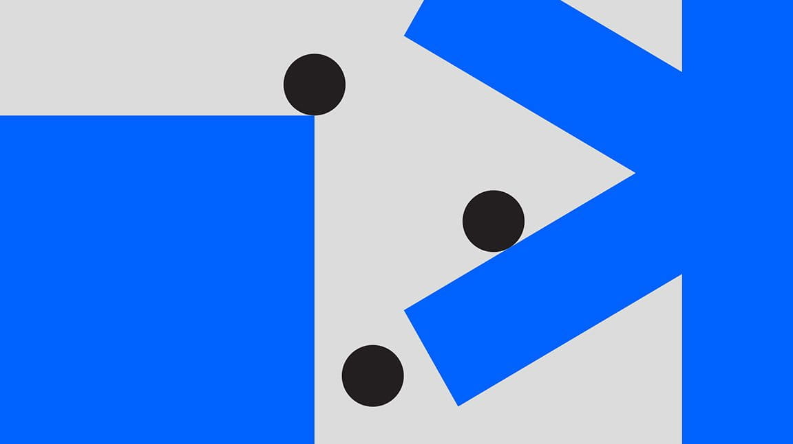

<PageDescription>

This is a demo page to see variations on components before/after headings.

</PageDescription>

<AnchorLinks>
  <AnchorLink>Headers and Paragraphs</AnchorLink>
  <AnchorLink>Headers and Videos</AnchorLink>
  <AnchorLink>Headers and Images</AnchorLink>
  <AnchorLink>Headers & Lists</AnchorLink>
  <AnchorLink>Headers and Accordions</AnchorLink>
  <AnchorLink>Headers and Tables</AnchorLink>
  <AnchorLink>Headers and Tabs</AnchorLink>
  <AnchorLink>Headers and Code</AnchorLink>
  <AnchorLink>Paragraph and Video</AnchorLink>
  <AnchorLink>Paragraph and Image</AnchorLink>
  <AnchorLink>Paragraph and Lists</AnchorLink>
  <AnchorLink>Paragraph and Accordion</AnchorLink>
  <AnchorLink>Paragraph and Tables</AnchorLink>
  <AnchorLink>Paragraph and Tabs</AnchorLink>
  <AnchorLink>Paragraph and Code</AnchorLink>
  <AnchorLink>Code and Nested Lists</AnchorLink>
  <AnchorLink>Notifications and Lists</AnchorLink>
</AnchorLinks>

## testing lists

1. First ordered list item
2. Item with a nested item
   1. Nested list item
   2. Another nested list item



3. This is technically a new ordered list, but we've given it the start
   attribute of 3
4. To continue from the list above
5. The rest of the numbers don't matter, but the starting number does

| Tables        |      Are      |   Cool |
| ------------- | :-----------: | -----: |
| col 3 is      | right-aligned | \$1600 |
| col 2 is      |   centered    |   \$12 |
| zebra stripes |   are neat    |    \$1 |

6. This is also a new ordered list, but we've given it the start attribute of 7
7. The rest of the numbers don't matter, but the starting number does

- Unordered list can use asterisks
  - Nested list item
  - Nested list item


- Or hyphens to create list items
- Unordered list can use asterisks

| Tables        |      Are      |   Cool |
| ------------- | :-----------: | -----: |
| col 3 is      | right-aligned | \$1600 |
| col 2 is      |   centered    |   \$12 |
| zebra stripes |   are neat    |    \$1 |

- Or hyphens to create list items
- Or hyphens to create list items
- Or hyphens to create list items

## Headers and Paragraphs

## Header 2

I’m a paragraph underneath an h2. Lorem ipsum dolor sit amet, consectetur
adipiscers elit, sed do eiusmod tempor incididunt ut labore et dolore magna
aliqua. Ut enim ad minim veniam, quis nostrud exercitation ullamco laboris nisi
ut aliquip ex ea commodo consequat. Duis aute irure dolor in reprehenderit in
voluptate velit esse cillum dolore eu fugiat nulla pariatur. Excepteur sint
occaecat cupidatat non proident, sunt in culpa qui officia deserunt mollit anim
id est laborum<sup>2</sup>.

### Header 3

I’m a paragraph underneath an h3. Lorem ipsum dolor sit amet, consectetur
adipiscers elit, sed do eiusmod tempor incididunt ut labore et dolore magna
aliqua. Ut enim ad minim veniam, quis nostrud exercitation ullamco laboris nisi
ut aliquip ex ea commodo consequat. Duis aute irure dolor in reprehenderit in
voluptate velit esse cillum dolore eu fugiat nulla pariatur. Excepteur sint
occaecat cupidatat non proident, sunt in culpa qui officia deserunt mollit anim
id est laborum.

#### Header 4

I’m a paragraph underneath an h4. Lorem ipsum dolor sit amet, consectetur
adipiscers elit, sed do eiusmod tempor incididunt ut labore et dolore magna
aliqua. Ut enim ad minim veniam, quis nostrud exercitation ullamco laboris nisi
ut aliquip ex ea commodo consequat. Duis aute irure dolor in reprehenderit in
voluptate velit esse cillum dolore eu fugiat nulla pariatur. Excepteur sint
occaecat cupidatat non proident, sunt in culpa qui officia deserunt mollit anim
id est laborum.

## Headers and Videos

## Header 2

<Video src="/videos/hero-video.mp4" poster="./poster.jpg">
  <track default src="/videos/vtt/hero-video.vtt" srcLang="en" />
</Video>

### Header 3

<Video src="/videos/hero-video.mp4" poster="./poster.jpg">
  <track default src="/videos/vtt/hero-video.vtt" srcLang="en" />
</Video>

#### Header 4

<Video src="/videos/hero-video.mp4" poster="./poster.jpg">
  <track default src="/videos/vtt/hero-video.vtt" srcLang="en" />
</Video>

## Headers and Images

## Header 2


<Caption>
  This is a regular caption. It will attempt to respond to it’s container
  element appropriately.
</Caption>

### Header 3


<Caption>
  This is a regular caption. It will attempt to respond to it’s container
  element appropriately.
</Caption>

#### Header 4


<Caption>
  This is a regular caption. It will attempt to respond to it’s container
  element appropriately.
</Caption>

## Headers & Lists

## Header 2

1. First ordered list item
2. Item with a nested item
   1. Nested list item
3. In markdown, the actual numbers don’t matter, just that it’s a number

- Unordered list can use asterisks
  - Nested list item
- Or hyphens to create list items

### Header 3

1. First ordered list item
2. Item with a nested item
   1. Nested list item
3. In markdown, the actual numbers don’t matter, just that it’s a number

- Unordered list can use asterisks
  - Nested list item
- Or hyphens to create list items

#### Header 4

1. First ordered list item
2. Item with a nested item
   1. Nested list item
3. In markdown, the actual numbers don’t matter, just that it’s a number

- Unordered list can use asterisks
  - Nested list item
- Or hyphens to create list items

## Headers and Accordions

## Header 2

<Accordion>
  <AccordionItem title="Title 1">Content Section</AccordionItem>
  <AccordionItem title="Title 2">Content Section</AccordionItem>
  <AccordionItem title="Title 3">Content Section</AccordionItem>
</Accordion>

### Header 3

<Accordion>
  <AccordionItem title="Title 1">Content Section</AccordionItem>
  <AccordionItem title="Title 2">Content Section</AccordionItem>
  <AccordionItem title="Title 3">Content Section</AccordionItem>
</Accordion>

#### Header 4

<Accordion>
  <AccordionItem title="Title 2">Content Section</AccordionItem>
  <AccordionItem title="Title 1">Content Section</AccordionItem>
  <AccordionItem title="Title 3">Content Section</AccordionItem>
</Accordion>

## Headers and Tables

## Header 2

| Tables        |      Are      |   Cool |
| ------------- | :-----------: | -----: |
| col 3 is      | right-aligned | \$1600 |
| col 2 is      |   centered    |   \$12 |
| zebra stripes |   are neat    |    \$1 |

### Header 3

| Tables        |      Are      |   Cool |
| ------------- | :-----------: | -----: |
| col 3 is      | right-aligned | \$1600 |
| col 2 is      |   centered    |   \$12 |
| zebra stripes |   are neat    |    \$1 |

#### Header 4

| Tables        |      Are      |   Cool |
| ------------- | :-----------: | -----: |
| col 3 is      | right-aligned | \$1600 |
| col 2 is      |   centered    |   \$12 |
| zebra stripes |   are neat    |    \$1 |

## Headers and Tabs

## Header 2

<Tabs>

<Tab label="Text">

The tab component can be used for a variety of content. From text, to images, to
columns. If you want to have multiple columns, you’ll need to use our `Row` and
`Column` helpers as demonstrated in the "Two images" tab.

</Tab>

<Tab label="Single image">

If your content is full width, you don’t need `Row` and `Column`


</Tab>

<Tab label="Two images">

<Row>
<Column colSm={6} colLg={6}>

Column one


</Column>
<Column colSm={6} colLg={6}>

Column two


</Column>
</Row>

</Tab>

</Tabs>

### Header 3

<Tabs>

<Tab label="Text">

The tab component can be used for a variety of content. From text, to images, to
columns. If you want to have multiple columns, you’ll need to use our `Row` and
`Column` helpers as demonstrated in the "Two images" tab.

</Tab>

<Tab label="Single image">

If your content is full width, you don’t need `Row` and `Column`


</Tab>

<Tab label="Two images">

<Row>
<Column colSm={6} colLg={6}>

Column one


</Column>
<Column colSm={6} colLg={6}>

Column two


</Column>
</Row>

</Tab>

</Tabs>

#### Header 4

<Tabs>

<Tab label="Text">

The tab component can be used for a variety of content. From text, to images, to
columns. If you want to have multiple columns, you’ll need to use our `Row` and
`Column` helpers as demonstrated in the "Two images" tab.

</Tab>

<Tab label="Single image">

If your content is full width, you don’t need `Row` and `Column`


</Tab>

<Tab label="Two images">

<Row>
<Column colSm={6} colLg={6}>

Column one


</Column>
<Column colSm={6} colLg={6}>

Column two


</Column>
</Row>

</Tab>

</Tabs>

## Headers and Code

## Header 2

```mdx path=components/Accordion/Accordion.js src=https://github.com/carbon-design-system/gatsby-theme-carbon/tree/main/packages/gatsby-theme-carbon/src/components/Accordion
<Accordion>
  <AccordionItem title="Title 1">Content Section</AccordionItem>
  <AccordionItem title="Title 2">Content Section</AccordionItem>
  <AccordionItem title="Title 3">Content Section</AccordionItem>
</Accordion>
```

### Header 3

```mdx path=components/Accordion/Accordion.js src=https://github.com/carbon-design-system/gatsby-theme-carbon/tree/main/packages/gatsby-theme-carbon/src/components/Accordion
<Accordion>
  <AccordionItem title="Title 1">Content Section</AccordionItem>
  <AccordionItem title="Title 2">Content Section</AccordionItem>
  <AccordionItem title="Title 3">Content Section</AccordionItem>
</Accordion>
```

#### Header 4

```mdx path=components/Accordion/Accordion.js src=https://github.com/carbon-design-system/gatsby-theme-carbon/tree/main/packages/gatsby-theme-carbon/src/components/Accordion
<Accordion>
  <AccordionItem title="Title 1">Content Section</AccordionItem>
  <AccordionItem title="Title 2">Content Section</AccordionItem>
  <AccordionItem title="Title 3">Content Section</AccordionItem>
</Accordion>
```

## Paragraph and Video

I’m a paragraph above a video. Lorem ipsum dolor sit amet, consectetur
adipiscers elit, sed do eiusmod tempor incididunt ut labore et dolore magna
aliqua. Ut enim ad minim veniam, quis nostrud exercitation ullamco laboris nisi
ut aliquip ex ea commodo consequat. Duis aute irure dolor in

<Video src="/videos/hero-video.mp4" poster="./poster.jpg">
  <track default src="/videos/vtt/hero-video.vtt" srcLang="en" />
</Video>

I’m a paragraph below a video. Lorem ipsum dolor sit amet, consectetur
adipiscers elit, sed do eiusmod tempor incididunt ut labore et dolore magna
aliqua. Ut enim ad minim veniam, quis nostrud exercitation ullamco laboris nisi
ut aliquip ex ea commodo consequat. Duis aute irure dolor in

## Paragraph and Image

I’m a paragraph above an image. Lorem ipsum dolor sit amet, consectetur
adipiscers elit, sed do eiusmod tempor incididunt ut labore et dolore magna
aliqua. Ut enim ad minim veniam, quis nostrud exercitation ullamco laboris nisi
ut aliquip ex ea commodo consequat. Duis aute irure dolor in


I’m a paragraph below an image. Lorem ipsum dolor sit amet, consectetur
adipiscers elit, sed do eiusmod tempor incididunt ut labore et dolore magna
aliqua. Ut enim ad minim veniam, quis nostrud exercitation ullamco laboris nisi
ut aliquip ex ea commodo consequat. Duis aute irure dolor in

## Paragraph and Lists

I’m a paragraph above a list. Lorem ipsum dolor sit amet, consectetur adipiscers
elit, sed do eiusmod tempor incididunt ut labore et dolore magna aliqua. Ut enim
ad minim veniam, quis nostrud exercitation ullamco laboris nisi ut aliquip ex ea
commodo consequat. Duis aute irure dolor in

1. First ordered list item. Lorem ipsum dolor sit amet, consectetur adipiscers
   elit, sed do eiusmod tempor incididunt ut labore et dolore magna aliqua. Ut
   enim ad minim veniam, quis nostrud exercitation ullamco laboris nisi ut
   aliquip ex ea commodo consequat.
2. Item with a nested item. Lorem ipsum dolor sit amet, consectetur adipiscers
   elit, sed do eiusmod tempor incididunt ut labore et dolore magna aliqua. Ut
   enim ad minim veniam, quis nostrud exercitation ullamco laboris nisi ut
   aliquip ex ea commodo consequat.
   1. Nested list item. Lorem ipsum dolor sit amet, consectetur adipiscers elit,
      sed do eiusmod tempor incididunt ut labore et dolore magna aliqua. Ut enim
      ad minim veniam, quis nostrud exercitation ullamco laboris nisi ut aliquip
      ex ea commodo consequat.
3. In markdown, the actual numbers don’t matter, just that it’s a number

- Unordered list can use asterisks
  - Nested list item
- Or hyphens to create list items

I’m a paragraph below a list. Lorem ipsum dolor sit amet, consectetur adipiscers
elit, sed do eiusmod tempor incididunt ut labore et dolore magna aliqua. Ut enim
ad minim veniam, quis nostrud exercitation ullamco laboris nisi ut aliquip ex ea
commodo consequat. Duis aute irure dolor in

## Paragraph and Accordion

I’m a paragraph above an Accordion. Lorem ipsum dolor sit amet, consectetur
adipiscers elit, sed do eiusmod tempor incididunt ut labore et dolore magna
aliqua. Ut enim ad minim veniam, quis nostrud exercitation ullamco laboris nisi
ut aliquip ex ea commodo consequat. Duis aute irure dolor in

<Accordion>
  <AccordionItem title="Title 1">Content Section</AccordionItem>
  <AccordionItem title="Title 2">Content Section</AccordionItem>
  <AccordionItem title="Title 3">Content Section</AccordionItem>
</Accordion>

I’m a paragraph below an Accordion. Lorem ipsum dolor sit amet, consectetur
adipiscers elit, sed do eiusmod tempor incididunt ut labore et dolore magna
aliqua. Ut enim ad minim veniam, quis nostrud exercitation ullamco laboris nisi
ut aliquip ex ea commodo consequat. Duis aute irure dolor in

## Paragraph and Tables

I’m a paragraph above a table. Lorem ipsum dolor sit amet, consectetur
adipiscers elit, sed do eiusmod tempor incididunt ut labore et dolore magna
aliqua. Ut enim ad minim veniam, quis nostrud exercitation ullamco laboris nisi
ut aliquip ex ea commodo consequat. Duis aute irure dolor in

| Tables        |      Are      |   Cool |
| ------------- | :-----------: | -----: |
| col 3 is      | right-aligned | \$1600 |
| col 2 is      |   centered    |   \$12 |
| zebra stripes |   are neat    |    \$1 |

I’m a paragraph below a table. Lorem ipsum dolor sit amet, consectetur
adipiscers elit, sed do eiusmod tempor incididunt ut labore et dolore magna
aliqua. Ut enim ad minim veniam, quis nostrud exercitation ullamco laboris nisi
ut aliquip ex ea commodo consequat. Duis aute irure dolor in

## Paragraph and Tabs

I’m a paragraph above Tabs. Lorem ipsum dolor sit amet, consectetur adipiscers
elit, sed do eiusmod tempor incididunt ut labore et dolore magna aliqua. Ut enim
ad minim veniam, quis nostrud exercitation ullamco laboris nisi ut aliquip ex ea
commodo consequat. Duis aute irure dolor in

<Tabs>

<Tab label="Text">

The tab component can be used for a variety of content. From text, to images, to
columns. If you want to have multiple columns, you’ll need to use our `Row` and
`Column` helpers as demonstrated in the "Two images" tab.

</Tab>

<Tab label="Single image">

If your content is full width, you don’t need `Row` and `Column`


</Tab>

<Tab label="Two images">

<Row>
<Column colSm={6} colLg={6}>

Column one


</Column>
<Column colSm={6} colLg={6}>

Column two


</Column>
</Row>

</Tab>

</Tabs>

I’m a paragraph below Tabs. Lorem ipsum dolor sit amet, consectetur adipiscers
elit, sed do eiusmod tempor incididunt ut labore et dolore magna aliqua. Ut enim
ad minim veniam, quis nostrud exercitation ullamco laboris nisi ut aliquip ex ea
commodo consequat. Duis aute irure dolor in

## Paragraph and Code

I’m a paragraph above code. Lorem ipsum dolor sit amet, consectetur adipiscers
elit, sed do eiusmod tempor incididunt ut labore et dolore magna aliqua. Ut enim
ad minim veniam, quis nostrud exercitation ullamco laboris nisi ut aliquip ex ea
commodo consequat. Duis aute irure dolor in

```mdx path=components/Tabs/Tabs.js src=https://github.com/carbon-design-system/gatsby-theme-carbon/tree/main/packages/gatsby-theme-carbon/src/components/Tabs
<Tab label="Two images">

<Row>
<Column colSm={6} colLg={6}>

Column one


</Column>
<Column colSm={6} colLg={6}>

Column two


</Column>
</Row>

</Tab>

// Make sure you close the wrapper component

</Tabs>
```

I’m a paragraph below code. Lorem ipsum dolor sit amet, consectetur adipiscers
elit, sed do eiusmod tempor incididunt ut labore et dolore magna aliqua. Ut enim
ad minim veniam, quis nostrud exercitation ullamco laboris nisi ut aliquip ex ea
commodo consequat. Duis aute irure dolor in

## Code & Nested Lists

<Title>Ordered List</Title>

1. Fist ordered list item
2. Item with a nested code block. Perspiciatis cupiditate eveniet reprehenderit.
   Dolores eum dolor at officia qui libero adipisci. Consequuntur culpa qui
   laudantium iure reiciendis mollitia est eveniet illum. Sunt ut et. Quia earum
   dolore dolor.

   ```mdx path=components/Accordion/Accordion.js src=https://github.com/carbon-design-system/gatsby-theme-carbon/tree/main/packages/gatsby-theme-carbon/src/components/Accordion
   <Accordion>
     <AccordionItem title="Title 1">Content Section</AccordionItem>
     <AccordionItem title="Title 2">Content Section</AccordionItem>
     <AccordionItem title="Title 3">Content Section</AccordionItem>
   </Accordion>
   ```

3. Third ordered list item
4. Item with nested list. Consequuntur et excepturi aperiam labore accusamus.
   Fuga itaque ut molestiae quia minus voluptatem iste officiis enim.
   Reprehenderit et aperiam. Rerum molestiae delectus iusto provident sint
   cupiditate.

   1. Nested list item with code blcok. Consequuntur et excepturi aperiam labore
      accusamus. Fuga itaque ut molestiae quia minus voluptatem iste officiis
      enim. Reprehenderit et aperiam. Rerum molestiae delectus iusto provident
      sint cupiditate.

      ```mdx path=components/Accordion/Accordion.js src=https://github.com/carbon-design-system/gatsby-theme-carbon/tree/main/packages/gatsby-theme-carbon/src/components/Accordion
      <Accordion>
        <AccordionItem title="Title 1">Content Section</AccordionItem>
        <AccordionItem title="Title 2">Content Section</AccordionItem>
        <AccordionItem title="Title 3">Content Section</AccordionItem>
      </Accordion>
      ```

<Title>Unordered List</Title>

- Unorderd list item
- Item with a nested code block. Perspiciatis cupiditate eveniet reprehenderit.
  Dolores eum dolor at officia qui libero adipisci. Consequuntur culpa qui
  laudantium iure reiciendis mollitia est eveniet illum. Sunt ut et. Quia earum
  dolore dolor.

  ```mdx path=components/Accordion/Accordion.js src=https://github.com/carbon-design-system/gatsby-theme-carbon/tree/main/packages/gatsby-theme-carbon/src/components/Accordion
  <Accordion>
    <AccordionItem title="Title 1">Content Section</AccordionItem>
    <AccordionItem title="Title 2">Content Section</AccordionItem>
    <AccordionItem title="Title 3">Content Section</AccordionItem>
  </Accordion>
  ```

- Unorderd list item
- Item with nested list. Consequuntur et excepturi aperiam labore accusamus.
  Fuga itaque ut molestiae quia minus voluptatem iste officiis enim.
  Reprehenderit et aperiam. Rerum molestiae delectus iusto provident sint
  cupiditate.

  - Nested list item with code blcok. Consequuntur et excepturi aperiam labore
    accusamus. Fuga itaque ut molestiae quia minus voluptatem iste officiis
    enim. Reprehenderit et aperiam. Rerum molestiae delectus iusto provident
    sint cupiditate.

    ```mdx path=components/Accordion/Accordion.js src=https://github.com/carbon-design-system/gatsby-theme-carbon/tree/main/packages/gatsby-theme-carbon/src/components/Accordion
    <Accordion>
      <AccordionItem title="Title 1">Content Section</AccordionItem>
      <AccordionItem title="Title 2">Content Section</AccordionItem>
      <AccordionItem title="Title 3">Content Section</AccordionItem>
    </Accordion>
    ```

## Notifications and Lists

<InlineNotification>

A basic Notification. Omnis officiis culpa enim harum qui sint soluta qui nam.
Labore minus sunt suscipit reiciendis laudantium nihil dolores quia. Enim quod
ea omnis nihil cum. Similique consequatur illum ea libero quam. Earum quis vel
fugiat dicta sapiente.

</InlineNotification>

- a list item. Omnis officiis culpa enim harum qui sint soluta qui nam. Labore
  minus sunt suscipit reiciendis laudantium nihil dolores quia. Enim quod ea
  omnis nihil cum. Similique consequatur illum ea libero quam. Earum quis vel
  fugiat dicta sapiente.

  <InlineNotification>

  A basic Notification.Omnis officiis culpa enim harum qui sint soluta qui nam.
  Labore minus sunt suscipit reiciendis laudantium nihil dolores quia. Enim quod
  ea omnis nihil cum. Similique consequatur illum ea libero quam. Earum quis vel
  fugiat dicta sapiente.

  </InlineNotification>

- another item. Omnis officiis culpa enim harum qui sint soluta qui nam. Labore
  minus sunt suscipit reiciendis laudantium nihil dolores quia. Enim quod ea
  omnis nihil cum. Similique consequatur illum ea libero quam. Earum quis vel
  fugiat dicta sapiente.

  - with a Notification. Omnis officiis culpa enim harum qui sint soluta qui
    nam. Labore minus sunt suscipit reiciendis laudantium nihil dolores quia.
    Enim quod ea omnis nihil cum. Similique consequatur illum ea libero quam.
    Earum quis vel fugiat dicta sapiente.

    <InlineNotification>

    A basic Notification. Omnis officiis culpa enim harum qui sint soluta qui
    nam. Labore minus sunt suscipit reiciendis laudantium nihil dolores quia.
    Enim quod ea omnis nihil cum. Similique consequatur illum ea libero quam.
    Earum quis vel fugiat dicta sapiente.

    </InlineNotification>
